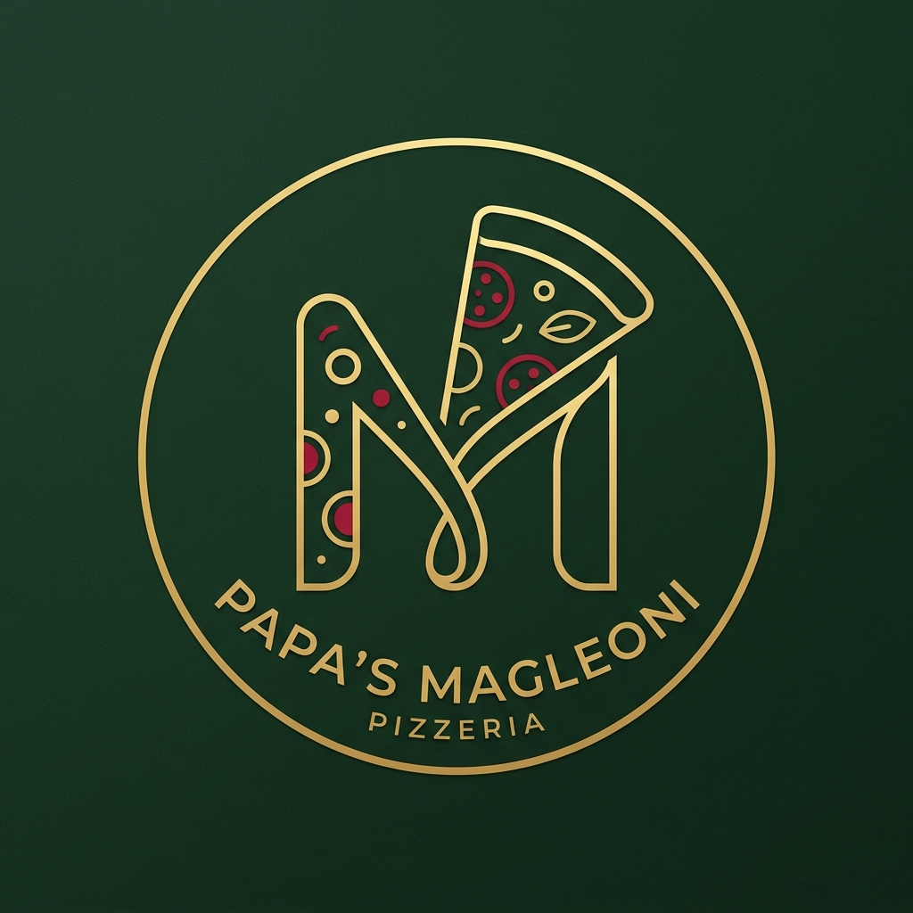

# 5️⃣ Identidade Visual

## Nome da Empresa
Papa's Magleoni Pizzaria
Slogan: "Sabor que reúne, momentos que ficam."

## Paleta de Cores
A paleta foi inspirada nas cores tradicionais da Itália:
- Verde Escuro: #1E3D2B (usado no fundo das seções e cabeçalho)
- Vermelho: #B22B2B (usado nos botões, preços e destaques)
- Creme: #F2E8D1 (usado nos textos claros e no fundo do cardápio)
- Marrom: #8C4A2F (usado nos textos secundários e descrições)

## Tipografia
- Bebas Neue: Para títulos e logos (trazendo um ar de pizzaria tradicional)
- Montserrat: Para o corpo do texto e parágrafos (para melhor leitura no mobile)

## Logo Oficial
A logo oficial é composta pela tipografia e o ícone do forno. Ela está salva na pasta logo como `logo-magleoni.png`.

